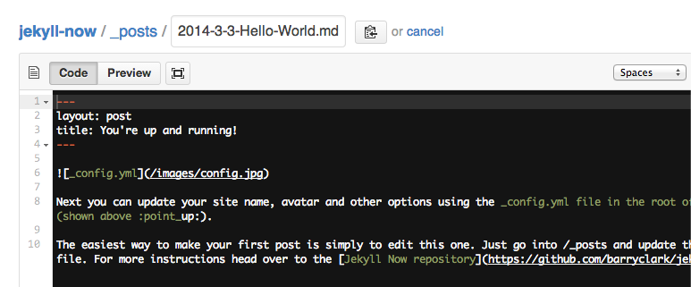

Inyo is a scriptable (AppleScript) dialog utility optimized for high-visibility messaging and data entry. Inyo's display is a full-screen, modal "overlay" that requires you to intentionally acknowledge notifications or input requests (hence "in yo' face" - btw, [icon = inyo](#icon)). Example use cases:

* full screen notification
* prompt for user input
* I/O for a custom workflow
* display an external webpage
* kiosk mode (with text and input fields formatted large)

Content formatting can range from simple plain text, to markdown or full html. Inyo was inspired from (the awesome) [Alfred](http://www.alfredapp.com/), and its "Large Type" functionality, but we added **ALL** the bells and whistles.


## Quick Example

Inyo is accessed via AppleScript. It can be invoked from the shell with `osascript`, run from Script Editor (or valid saved file formats - `.applescript`, `.scpt`, etc) or accessed with any application that can call AppleScript.

Try this Inyo [_query_](documentation.html#query) with customized options (it should look like <a href="images/maschine.png" data-lightbox="image-1" data-title="My caption">this</a>).

#### At shell prompt

```sh
osascript -e 'tell application "Inyo"' -e 'query  "Enter your name" windowcolor "red" windowopacity 40 inputcolor "#0000ff" inputplaceholder "first name" focus true' -e 'end tell'
```

#### In Script Editor using AppleScript

```applescript
tell application "Inyo"
  query "Enter your name" windowcolor "red" windowopacity 40 inputplaceholder "first name" focus true
end tell
```

#### In Script Editor using [JXA](https://developer.apple.com/library/mac/releasenotes/InterapplicationCommunication/RN-JavaScriptForAutomation/index.html)

```javascript
params = {
  windowcolor: 'red',
  windowopacity: 40,
  inputplaceholder: "first name",
  focus: true
}
Application('Inyo').query('Enter your name', params)
```


## Additional Examples

#### Notification
This uses [_notify_](documentation.html#notify) to display a message. This example is triggered from Keyboard Maestro and shows the current battery percentage (check out this blog post for more details on this specific example).
<a href="images/maschine.png" data-lightbox="image-2" data-title="h"></a>

```javascript
pf = Application('Inyo')
params = {
    windowcolor: 'orange',
    timer: 10,
    block: false
}
pf.notify('$KMVAR_inyoMessage', params)
```

#### Query
This uses **query** to prompt for input. This example is triggered from Keyboard Maestro and prompts the user for input (check out this blog post for more details on this specific example).
<a href="images/maschine.png" data-lightbox="image-2" data-title="h"></a>

```
code
```


#### HTML Page
This uses **notify** to display an external url.
<a href="images/maschine.png" data-lightbox="image-2" data-title="h"></a>

```
code
```

#### HTML Form
This uses **query** to present an HTML form. Using HTML in conjunction with **query** allows for the creation of sophisticated forms with numerous form elements.
<a href="images/maschine.png" data-lightbox="image-2" data-title="h"></a>

```
code
```

#### Bugs on your screen
This uses **notify** to display an HTML page which loads the javascript library, [Bug](http://auz.github.io/Bug/). We cannot vouch that this has much utility, but it does illustrate Inyo's potential for creative hacking.
<a href="images/maschine.png" data-lightbox="image-2" data-title="h"></a>

```
code
```

Bugs crawling on the screen....
